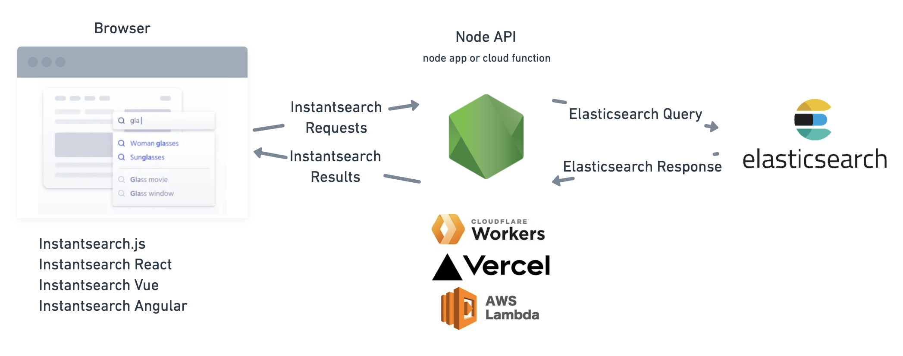

# ISES: Instantsearch Elasticsearch Adapter

Use Instantsearch with Elasticsearch & ISES

InstantSearch Elasticsearch Adapter is a javascript library that lets you use Elasticsearch with Algolia's Instantsearch, a javascript library for building performant and instant search experiences.

Here is an example of UI you can build with this adapter and Elasticsearch: [IMDB Movies Demo](https://ises.vercel.app/demo)

With the adapter in this repository, you'll be able to use [Instantsearch.js](https://github.com/algolia/instantsearch.js) plus:

- [Instantsearch.js](https://github.com/algolia/instantsearch.js)
- [React InstantSearch](https://github.com/algolia/react-instantsearch)
- [Vue InstantSearch](https://github.com/algolia/vue-instantsearch)
- [Angular InstantSearch](https://github.com/algolia/angular-instantsearch)

to quickly build great search experiences with Elasticsearch.

## How it works



The adapter provides two public libraries:

- A node API which transforms instantsearch requests into Elasticsearch queries
- a lightweight frontend client that integrates with the instantsearch library and the Adapter's node API

[Edit in CodeSandbox](https://codesandbox.io/s/ises-template-k4tz09)

## Get started

Follow the [getting started guide](https://ises.vercel.app/docs//getting-started) or [Edit in CodeSandbox](https://codesandbox.io/s/ises-template-k4tz09)

### Easy Integration

Its very easy to integrate it in your app, once you have indexed your data in Elasticsearch, you can use the adapter and instantsearch of your choice to query your data and display it in your website / app.

### Install dependencies

React InstantSearch is available on the npm registry. It relies on @ises/client to communicate with the node API.

```
yarn add @ises/api @ises/client react-instantsearch-dom
# OR
npm install @ises/api @ises/client react-instantsearch-dom
```

#### API Setup

This creates an API which transforms the instantsearch requests sent from the browser into Elasticsearch queries and transforms the responses into instantsearch results.

```ts
import Client from "@ises/api";
import { NextApiRequest, NextApiResponse } from "next";

const client = Client({
  connection: {
    host: "<elasticsearch-host>",
    apiKey: "<api-key>", // optional
  },
  search_settings: {
    highlight_attributes: ["title", "actors"],
    search_attributes: ["title", "actors"],
    result_attributes: ["title", "actors"],
    facet_attributes: ["type", "rated"],
  },
});

// example API handler for Next.js
export default async function handler(
  req: NextApiRequest,
  res: NextApiResponse
) {
  const body = JSON.parse(req.body);
  const results = await client.handleRequest(body);
  res.send(results);
}
```

#### Frontend Setup

Using InstantSearch with Instantsearch Elasticsearch Adapter is as simple as adding this JavaScript code to your page:

```tsx
import React from "react";
import ReactDOM from "react-dom";
import Client from "@ises/client";
import { InstantSearch, SearchBox, Hits } from "react-instantsearch-dom";

const searchClient = Client({
  url: "/api/search", // API url
});

const App = () => (
  <InstantSearch indexName="bestbuy" searchClient={searchClient}>
    <SearchBox />
    <Hits />
  </InstantSearch>
);

export default App;
```

#### IMDB Movies Example

Demo site running Instantsearch React and Elasticsearch: [https://ises.vercel.app/demo](https://ises.vercel.app/demo)

- [Demo site](https://ises.vercel.app/demo)
- [Frontend Codebase](https://github.com/joemcelroy/instantsearch-elasticsearch-adapter/tree/main/apps/web/pages/demo.tsx)
- [API Codebase](https://github.com/joemcelroy/instantsearch-elasticsearch-adapter/tree/main/apps/web/pages/api/search.tsx)

## Found a Bug?

Not all features of Instantsearch is supported so you may encounter issues. If you do encounter issues or missing features, please [submit an issue](https://github.com/joemcelroy/instantsearch-elasticsearch-adapter/issues)!
