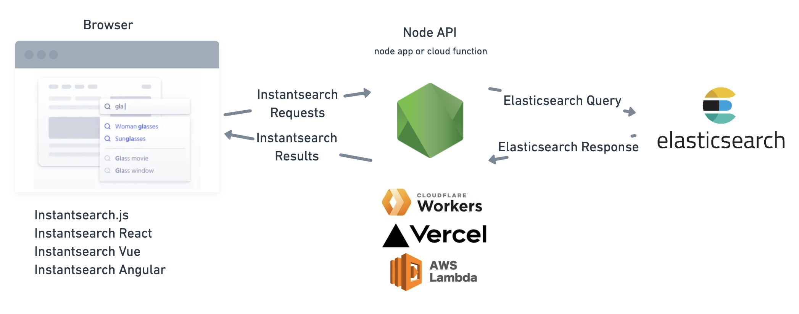

import Image from "next/image";
import Bleed from "nextra-theme-docs/bleed";

{<h1 className="text-center font-extrabold md:text-5xl mt-8">Instantsearch + Elasticsearch ❤️</h1>}

<Bleed>
  <div className="mx-auto max-w-full w-[880px] text-center px-4 mb-10">
    <p className="text-xl mb-2 text-gray-400 md:!text-2xl">
      Use Elasticsearch for your Instantsearch apps.
    </p>
  </div>
</Bleed>

<p className="text-center">
  ISES (InstantSearch Elasticsearch Adapter) is a javascript library that lets
  you use Elasticsearch with Algolia's Instantsearch, a javascript library for
  building performant and instant search experiences.
</p>

<div className="mt-6 mb-20 text-center">
  [Docs](/docs) · [Get Started](/docs/getting-started) ·
  [Examples](/examples/cloudflare-workers) · [GitHub
  Repository](https://github.com/joemcelroy/instantsearch-elasticsearch-adapter)
</div>

## How it works



The adapter provides two public libraries:

- [Node API](./reference/api) which transforms instantsearch requests into Elasticsearch queries
- [Browser client](./reference/client) that integrates with the instantsearch library and the Adapter's node API

With the adapter, you'll be able to use instantsearch frameworks to quickly build great search experiences with **Elasticsearch**.

- [Instantsearch.js](https://github.com/algolia/instantsearch.js)
- [React InstantSearch](https://github.com/algolia/react-instantsearch)
- [Vue InstantSearch](https://github.com/algolia/vue-instantsearch)
- [Angular InstantSearch](https://github.com/algolia/angular-instantsearch)

### How you can use it

Its very easy to integrate it in your app, once you have indexed your data in Elasticsearch, you can use the adapter and instantsearch to query your data and display it in your app.

#### Install the package

```bash
npm install @ises/client @ises/api
```

#### Setup the API

This creates an API which transforms the instantsearch requests sent from the browser into Elasticsearch queries and transforms the responses into instantsearch results.

```ts
import Client from "@ises/api";
import { NextApiRequest, NextApiResponse } from "next";

const client = Client({
  connection: {
    host: "<elasticsearch-host>",
    apiKey: "<api-key>", // optional
  },
  search_settings: {
    highlight_attributes: ["title", "actors"],
    search_attributes: ["title", "actors"],
    result_attributes: ["title", "actors"],
    facet_attributes: ["type", "rated"],
  },
});

// example API handler for Next.js
export default async function handler(
  req: NextApiRequest,
  res: NextApiResponse
) {
  const body = JSON.parse(req.body);
  const results = await client.handleRequest(body);
  res.send(results);
}
```

#### Setup the Frontend

Using InstantSearch with Instantsearch Elasticsearch Adapter is as simple as adding this JavaScript code to your page:

```tsx
import React from "react";
import ReactDOM from "react-dom";
import Client from "@ises/client";
import { InstantSearch, SearchBox, Hits } from "react-instantsearch-dom";

const searchClient = Client({
  url: "/api/search", // API url
});

const App = () => (
  <InstantSearch indexName="bestbuy" searchClient={searchClient}>
    <SearchBox />
    <Hits />
  </InstantSearch>
);

export default App;
```

#### IMDB Movies Example

Demo site running Instantsearch React and Elasticsearch: [https://ises.vercel.app/demo](https://ises.vercel.app/demo)

- [Demo site](/demo)
- [Frontend Codebase](https://github.com/joemcelroy/instantsearch-elasticsearch-adapter/tree/main/apps/web/pages/demo.tsx)
- [API Codebase](https://github.com/joemcelroy/instantsearch-elasticsearch-adapter/tree/main/apps/web/pages/api/search.tsx)

## Found a Bug?

Not all features of Instantsearch is supported so you may encounter issues. If you do encounter issues or missing features, please [submit an issue](https://github.com/joemcelroy/instantsearch-elasticsearch-adapter/issues)!
